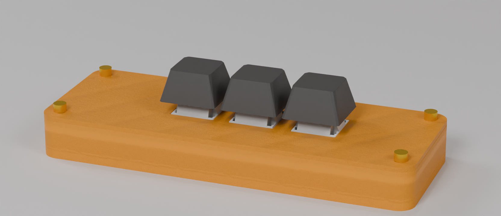
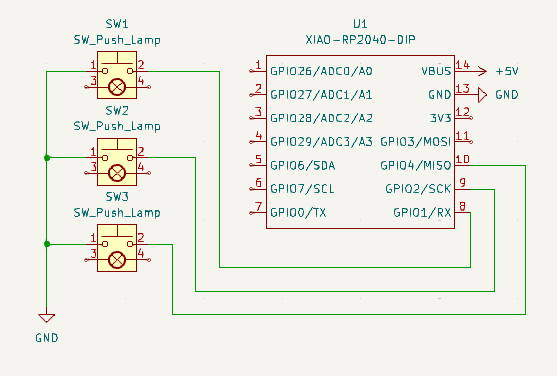
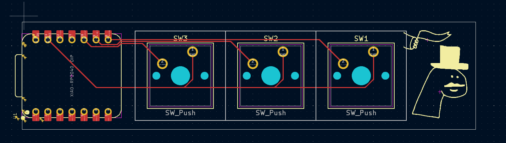
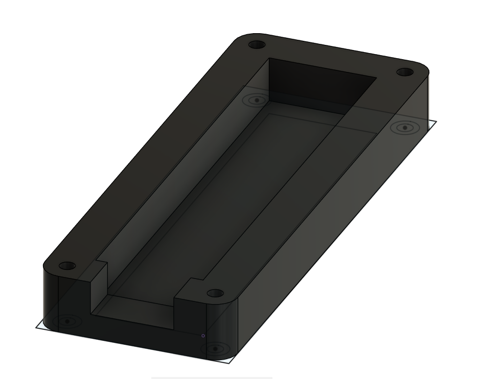
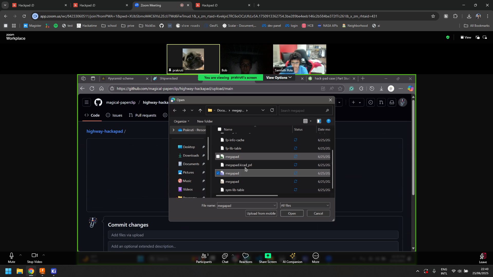
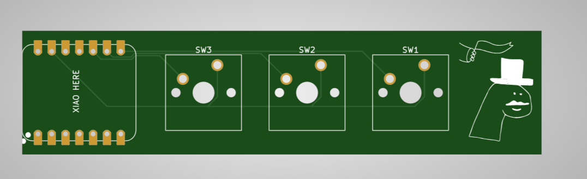

# We-Borrow-Code
#### We Permanently Borrow Code!

### Inspiration
I wanted a macropad for funsies and "barrowing" other peoples code.
I was thinking about makeing a micropad with just Tab. Since with vibe coding, thats all you need these days

### Challenges

This was my second time using Fusion 360! The first time i wanted to experiment on my own but it was a compete failure, so this was great to actualy learn to use the program. I'm very proud of the result.

### Specifications

BOM: 
- 3x Cherry MX Switches (blue)
- 1x XIAO RP2040
- 3x Blank DSA Keycaps (Black if posible)
- 4x M3x16mm Bolt
- 4x M3 Heatset
- 16x 1N4148 Diodes

Others:
- KMK Firmware
- topcase.3mf (im 3d printing it myself)
- casebottom.3mf (im 3d printing it myself)

Schematic            |  PCB         |   Case
:-------------------------:|:-------------------------:|:-------------------------:|
    |    | 

### I made this at midnight on a zoom with Samhith pola & Magical Paperclip

pcbway showed my the geibers were good
